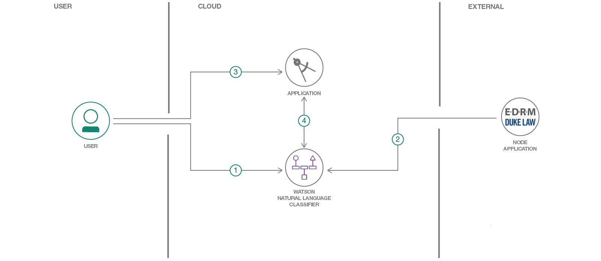

# Work In Progress! Please visit soon for the completed Code Pattern.

# Natural Language Classifier email spam classifier

In this Code Pattern, we will build an app that classifies email, either labeling it as "Phishing", "Spam", or "Ham" if it does not appear suspicious. We'll be using IBM Watson Natural Language Classifier (NLC) to train a model using email examples from an [EDRM Enron email dataset](https://www.edrm.net/resources/data-sets/edrm-enron-email-data-set/). The custom NLC model can be quickly and easily build in the Web UI, deployed into our nodejs app using the [Watson Developer Cloud Nodejs SDK](https://github.com/watson-developer-cloud/node-sdk), and then run from a browser.

When the reader has completed this Code Pattern, they will understand how to:

* Build a [Watson Natural Language Classifier](https://www.ibm.com/watson/services/natural-language-classifier/) model using the Web UI
* Create a nodejs app that utilizes the NLC model to classify emails as Phishing or not.
* Use the Watson Developer Cloud SDK for nodejs.

<!--Remember to dump an image in this path-->


## Flow
<!--Add new flow steps based on the architecture diagram-->
1. Step 1.
2. Step 2.
3. Step 3.
4. Step 4.
5. Step 5.

## Included components

* [Watson Studio](https://www.ibm.com/cloud/watson-studio): Analyze data using RStudio, Jupyter, and Python in a configured, collaborative environment that includes IBM value-adds, such as managed Spark.
* [Watson Natural Language Classifier](https://www.ibm.com/watson/services/natural-language-classifier/): An IBM Cloud service to interpret and classify natural language with confidence.

## Featured technologies

* [Artificial Intelligence](https://medium.com/ibm-watson): Artificial intelligence can be applied to disparate solution spaces to deliver disruptive technologies.
* [Data Science](https://medium.com/ibm-watson): Systems and scientific methods to analyze structured and unstructured data in order to extract knowledge and insights.
* [Node.js](https://nodejs.org/): An open-source JavaScript run-time environment for executing server-side JavaScript code.

<!--Update this section when the video is created-->
# Watch the Video

# Steps
Use the ``Deploy to IBM Cloud`` button **OR** create the services and run locally.

## Deploy to IBM Cloud
<!--Update the repo and tracking id-->
[](https://bluemix.net/deploy?repository=https://github.com/IBM/nlc-email-phishing.git)

1. Press the above ``Deploy to IBM Cloud`` button and then click on ``Deploy``.

<!--optional step-->
2. In Toolchains, click on Delivery Pipeline to watch while the app is deployed. Once deployed, the app can be viewed by clicking 'View app'.
<!--  -->

3. To see the app and service created and configured for this Code Pattern, use the IBM Cloud dashboard. The app is named `nlc-email-phishing` with a unique suffix. The following service are created:
    * nlc-email-phishing

## Run locally
> NOTE: These steps are only needed when running locally instead of using the ``Deploy to IBM Cloud`` button.

1. [Clone the repo](#1-clone-the-repo)
1. [Create Watson NLC service with IBM Cloud](#2-create-watson-nlc-service-with-ibm-cloud)
1. [Train the NLC model](#3-train-the-nlc-model)
1. [Configure credentials](#4-configure-credentials)
1. [Run the application](#5-run-the-application)

### 1. Clone the repo

Clone the `nlc-email-phishing` locally. In a terminal, run:

```
$ git clone https://github.com/IBM/nlc-email-phishing
```

### 2. Create Watson NLC service with IBM Cloud

* In [Watson Studio](https://dataplatform.cloud.ibm.com/) create a New Project by clicking the `New Project` tile or use `+ New project`:


* Under the `Settings` tab, scroll down to `Associated services`, click `+ Add service` and choose `Watson`:


* Find the `Natural Language Classifier` tile and click `Add`.

> Note: the `Standard` plan allows free usage before billing begins:

```
1 Natural Language Classifier free per month.
1000 API calls free per month
4 Training Events free per month
```

Once the service is created the `Credentials` will be on the page. Click `Show` to make them visible and copy them for later use when you [Configure credentials](#4-configure-credentials). You can always get to the credentials by clicking the `Service credentials` on the left.

### 3. Train the NLC model

### 4. Configure credentials

The credentials for all IBM Cloud services (Natural Language Understanding), can be found in the ``Services`` menu in IBM Cloud,
by selecting the ``Service Credentials`` option for each service.


Copy the [`env.sample`](env.sample) to `.env`.

```
$ cp env.sample .env
```
Edit the `.env` file with the necessary settings.

#### `env.sample:`

```
# Replace the credentials here with your own.
# Rename this file to .env before running run.py.

NATURAL_LANGUAGE_CLASSIFIER_USERNAME=<add_NLC_username>
NATURAL_LANGUAGE_CLASSIFIER_PASSWORD=<add_NLC_password>
NLC_CLASSIFIER=<add_NLC_classifier>
```

### 6. Run the application
1. Install [Node.js](https://nodejs.org/en/) runtime or NPM.
1. Start the app by running `npm install`, followed by `npm start`.
1. Use the app at `localhost:3000`.
> Note: server host can be changed as required in server.js and `PORT` can be set in `.env`.

<!--Add a section that explains to the reader what typical output looks like, include screenshots -->

# Sample output


<!--Include any troubleshooting tips (driver issues, etc)-->

# Troubleshooting

<!--Include any relevant links-->

# Links

* [Live web demo](https://nlc-email-spam.mybluemix.net/)
* [Demo on Youtube]()
* [Watson Node.js SDK](https://github.com/watson-developer-cloud/node-sdk)

<!-- pick the relevant ones from below -->
# Learn more

* **Artificial Intelligence Code Patterns**: Enjoyed this Code Pattern? Check out our other [AI Code Patterns](https://developer.ibm.com/code/technologies/artificial-intelligence/).
* **Data Analytics Code Patterns**: Enjoyed this Code Pattern? Check out our other [Data Analytics Code Patterns](https://developer.ibm.com/code/technologies/data-science/)
* **AI and Data Code Pattern Playlist**: Bookmark our [playlist](https://www.youtube.com/playlist?list=PLzUbsvIyrNfknNewObx5N7uGZ5FKH0Fde) with all of our Code Pattern videos
* **With Watson**: Want to take your Watson app to the next level? Looking to utilize Watson Brand assets? [Join the With Watson program](https://www.ibm.com/watson/with-watson/) to leverage exclusive brand, marketing, and tech resources to amplify and accelerate your Watson embedded commercial solution.
* **Data Science Experience**: Master the art of data science with IBM's [Data Science Experience](https://datascience.ibm.com/)

# License
[Apache 2.0](LICENSE)
